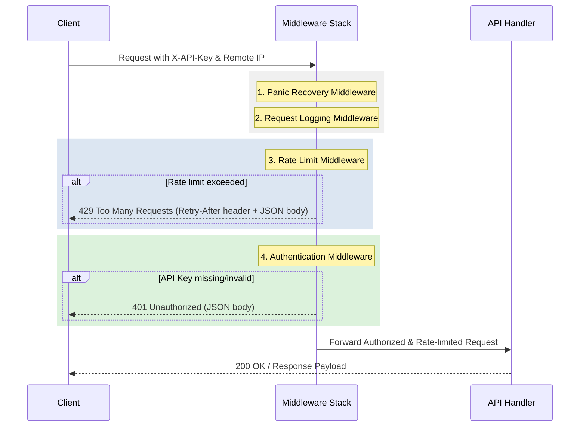

# Design: Auth and Rate Limit Middleware

## Technical Approach
We will secure the Venezuela Rates API by introducing two middleware layers:
1. **Authentication Middleware**: Verifies incoming requests contain a valid `X-API-Key` header matching the secret token loaded from config (`API_KEY`) using a timing-attack resistant comparison: hashing both the request key and the configured key using SHA-256 and comparing the 32-byte hashes via `subtle.ConstantTimeCompare`.
2. **Rate Limiting Middleware**: Implements per-client IP token-bucket rate limiting using `golang.org/x/time/rate`. A `sync.RWMutex` protecting a map of client IPs to their respective limiters will manage state in memory. A background janitor goroutine, controlled by a `context.Context` to prevent goroutine leaks, will periodically prune inactive limiters. Pruning will minimize lock contention by identifying expired entries under a read lock (`RLock`), then deleting them under a brief write lock (`Lock`). The `lastSeen` timestamp of each client will be managed using thread-safe atomic operations.

Both middlewares will be integrated into the Chi router pipeline.

## Architecture Decisions
### Decision: Atomic unix timestamp for lastSeen field
**Choice**: Use `int64` representing a Unix timestamp and `sync/atomic` functions to write and read `lastSeen` values.
**Alternatives considered**: Traditional mutex-guarded fields.
**Rationale**: Accessing `lastSeen` concurrently inside the request handler and background janitor can trigger a data race. `sync/atomic` provides a highly efficient, lock-free approach to update and retrieve the timestamp.

### Decision: Context-aware janitor lifecycle
**Choice**: Accept `context.Context` in `RateLimit` middleware initialization to allow stopping the background janitor goroutine.
**Alternatives considered**: Clean-up function return values, global channel.
**Rationale**: Accepting `context.Context` ensures the background ticker and goroutine terminate cleanly when the server or test suite context is cancelled, preventing goroutine leaks in test suites.

### Decision: SHA-256 hashing prior to subtle.ConstantTimeCompare
**Choice**: Hash request API key and configured API key with SHA-256, then compare the 32-byte digests.
**Alternatives considered**: Direct `subtle.ConstantTimeCompare` on raw strings.
**Rationale**: Direct comparison of raw strings via `ConstantTimeCompare` performs an early-return check on length difference, leaking key length. Hashing first ensures comparison is always done on constant-length 32-byte digests.

### Decision: Split-phase Map Pruning
**Choice**: Scan for expired clients under a Read Lock (`RLock()`), gather expired IPs, then delete them under a separate Write Lock (`Lock()`).
**Alternatives considered**: Iterating and deleting under a single Write Lock.
**Rationale**: Pruning a map under a full Lock block halts incoming requests during the entire iteration. Splitting the process into a read-only scan followed by rapid deletion minimizes lock contention.

## Data Flow


## File Changes
| File | Action | Description |
|------|--------|-------------|
| [internal/middleware/auth.go](file:///C:/Users/Windows%2011/OneDrive/Documentos/projects/backend-projects/go-projects/venezuela-rates-api/internal/middleware/auth.go) | Create | Auth middleware using SHA-256 hash and `subtle.ConstantTimeCompare` on `X-API-Key`. |
| [internal/middleware/ratelimit.go](file:///C:/Users/Windows%2011/OneDrive/Documentos/projects/backend-projects/go-projects/venezuela-rates-api/internal/middleware/ratelimit.go) | Create | Per-IP token-bucket rate limiter with context-controlled janitor, atomic timestamps, and split lock pruning. |
| [cmd/api/main.go](file:///C:/Users/Windows%2011/OneDrive/Documentos/projects/backend-projects/go-projects/venezuela-rates-api/cmd/api/main.go) | Modify | Wire `RateLimit` (with application context) and `Auth` middlewares in the Chi router. |

## Interfaces / Contracts

### Config Updates
No config changes are needed as `API_KEY` and `RATE_LIMIT` are already defined in [config.go](file:///C:/Users/Windows%2011/OneDrive/Documentos/projects/backend-projects/go-projects/venezuela-rates-api/internal/config/config.go).

### Middleware Signatures
```go
// In internal/middleware/auth.go
func Auth(apiKey string) func(http.Handler) http.Handler

// In internal/middleware/ratelimit.go
func RateLimit(ctx context.Context, limitPerMin int) func(http.Handler) http.Handler
```

### Type Definitions
```go
type client struct {
	limiter  *rate.Limiter
	lastSeen int64 // Unix timestamp (seconds), read/written atomically
}
```

### JSON Error Payloads
*   **401 Unauthorized**:
    ```json
    {"error":{"code":"UNAUTHORIZED","message":"unauthorized"}}
    ```
*   **429 Too Many Requests** (includes `Retry-After: <seconds>` header):
    ```json
    {"error":{"code":"TOO_MANY_REQUESTS","message":"too many requests"}}
    ```

## Testing Strategy
| Layer | What to Test | Approach |
|-------|-------------|----------|
| Unit / Integration | Auth Middleware | Test with valid `X-API-Key`, missing key, and invalid key using `httptest.NewRecorder`. Ensure constant-time hash comparison is used. |
| Unit / Integration | Rate Limit Middleware | Test request allowance up to burst capacity. Verify subsequent requests fail with 429 and `Retry-After` header. |
| Unit / Integration | Janitor Cleanup | Verify background janitor shuts down correctly when `ctx` is cancelled (leak test). Verify inactive clients are pruned safely without deadlock or data races. |
| Integration | Middleware Stack | Assert correct execution order: `Recovery` -> `Logging` -> `RateLimit` -> `Auth` using router test. |

## Migration / Rollout
No database migration is required. The configuration variables `API_KEY` and `RATE_LIMIT` must be properly defined in the production environment.

## Open Questions
- [ ] None.
