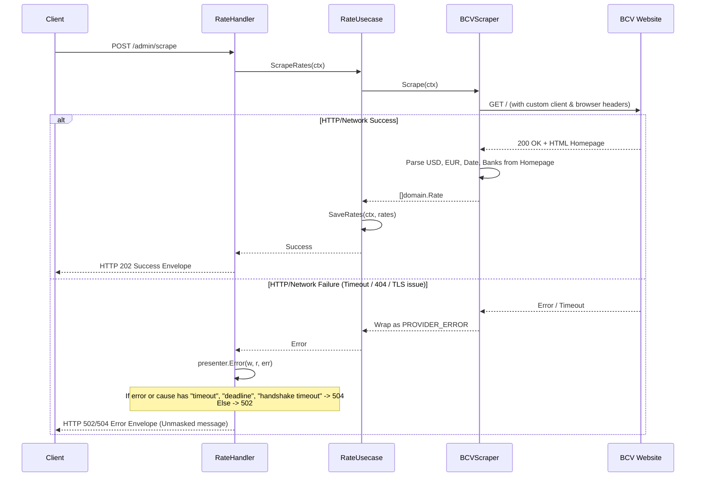

# Design: BCV Scraper Errors and Single Request Layout

## Technical Approach
Optimize BCV scraping by querying only the homepage (avoiding the unstable statistics page) and introduce a custom `PROVIDER_ERROR` to map external provider failures to correct HTTP status codes (502/504) with raw diagnostic messages.

## Architecture Decisions
### Decision: Consolidate Scraping on the BCV Homepage
**Choice**: Parse all data (USD, EUR, dates, and banks) from the BCV homepage in a single HTTP request, removing the `statsURL` argument from `NewBCVScraper`.
**Alternatives considered**: Retrying requests to the statistics page, or scraping them concurrently.
**Rationale**: The homepage contains the reference rates, the latest publication date, and the bank rates table. Fetching only the homepage halves external requests, bypasses statistics page 404s, and simplifies connection management.

### Decision: Custom HTTP Client and TLS Handshake Timeout
**Choice**: Inject a custom `*http.Client` built with a dedicated `http.Transport` configuring `TLSHandshakeTimeout` and `DialContext` timeouts.
**Alternatives considered**: Relying on `http.DefaultClient` or using a global context-level timeout.
**Rationale**: In Venezuelan network environments, TLS handshakes and connection establishment often stall. Configuring explicit timeouts at the transport level prevents requests from hanging indefinitely.

### Decision: Custom `PROVIDER_ERROR` with raw error exposure
**Choice**: Map scraper failures to `apierrors.PROVIDER_ERROR` and inspect the cause in `presenter.Error` to return HTTP 504 for timeouts or HTTP 502 for other errors.
**Alternatives considered**: Returning a generic HTTP 500 "internal server error".
**Rationale**: Diagnostic visibility is critical for scraping. Exposing the raw, unmasked error string allows developers and clients to distinguish transient network timeouts from parser failures.

## Data Flow


## File Changes
| File | Action | Description |
|------|--------|-------------|
| [internal/apierrors/apierrors.go](file:///C:/Users/Windows%2011/OneDrive/Documentos/projects/backend-projects/go-projects/venezuela-rates-api/internal/apierrors/apierrors.go) | Modified | Define `PROVIDER_ERROR` of type `Code` and helper `NewProviderError(error) *Error`. |
| [internal/presenter/presenter.go](file:///C:/Users/Windows%2011/OneDrive/Documentos/projects/backend-projects/go-projects/venezuela-rates-api/internal/presenter/presenter.go) | Modified | Update `Error` to intercept `PROVIDER_ERROR`, check for timeouts, set 502/504, and skip internal message masking. |
| [internal/scraper/scraper.go](file:///C:/Users/Windows%2011/OneDrive/Documentos/projects/backend-projects/go-projects/venezuela-rates-api/internal/scraper/scraper.go) | Modified | Update `NewBCVScraper` signature. Consolidate fetching/parsing on the homepage. Inject browser-like headers. Wrap errors in `PROVIDER_ERROR`. |
| [cmd/api/main.go](file:///C:/Users/Windows%2011/OneDrive/Documentos/projects/backend-projects/go-projects/venezuela-rates-api/cmd/api/main.go) | Modified | Wire custom `*http.Client` with timeouts. Initialize `BCVScraper` without `statsURL`. |
| [internal/scraper/scraper_test.go](file:///C:/Users/Windows%2011/OneDrive/Documentos/projects/backend-projects/go-projects/venezuela-rates-api/internal/scraper/scraper_test.go) | Modified | Adapt tests to mock only a single homepage request and use combined HTML fixture. |

## Interfaces / Contracts
### Custom Provider Error
```go
package apierrors

const PROVIDER_ERROR Code = "PROVIDER_ERROR"

type Error struct {
	Code    Code   `json:"code"`
	Message string `json:"message"`
	Err     error  `json:"-"` // underlying error cause
}

func (e *Error) Unwrap() error { return e.Err }

func NewProviderError(err error) *Error {
	return &Error{
		Code:    PROVIDER_ERROR,
		Message: err.Error(),
		Err:     err,
	}
}
```

### BCVScraper Constructor
```go
func NewBCVScraper(client *http.Client, homepageURL string) *BCVScraper
```

## Testing Strategy
| Layer | What to Test | Approach |
|-------|-------------|----------|
| Unit / Scraper | Parsing reference rates, date, and bank rates | Mock HTTP server serving combined HTML homepage and verify fields. |
| Unit / Scraper | Header Injection | Inspect mock HTTP request headers to verify `User-Agent`, `Accept`, and `Accept-Language`. |
| Unit / Presenter | Error Mapping (502 vs 504) | Invoke `presenter.Error` with wrapped timeout and non-timeout errors. Assert status codes (504/502) and raw messages. |

## Migration / Rollout
No database schema migrations are required. Backwards-compatible rollout.

## Open Questions
- None
